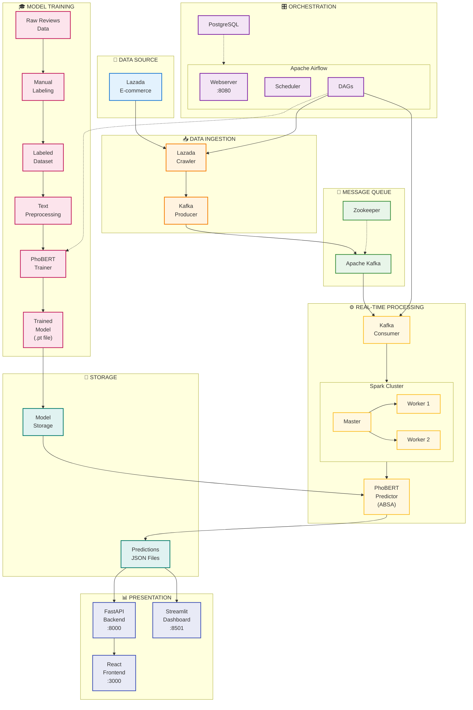

---

## 📋 Giải thích luồng:

### 1. Training Pipeline (Offline - Một lần)
```
Raw Reviews → Manual Labeling → Labeled Dataset → Preprocessing → PhoBERT Trainer → Trained Model (.pt)
```

### 2. Real-time Pipeline (Online - Liên tục)
```
Lazada → Crawler → Kafka Producer → Kafka → Consumer → Spark → PhoBERT Predictor → Predictions JSON
```

### 3. Presentation Layer
```
Predictions JSON → FastAPI → React Frontend
                → Streamlit Dashboard
```

---

## 🔧 Cách dùng với Draw.io:

1. Mở https://mermaid.live/
2. Paste code Mermaid (bỏ ``` mermaid và ```)
3. Export PNG/SVG
4. Import vào Draw.io

Hoặc trong Draw.io: **Arrange → Insert → Advanced → Mermaid**
