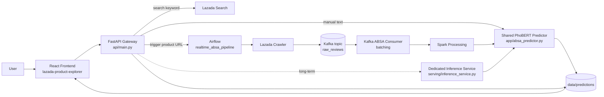
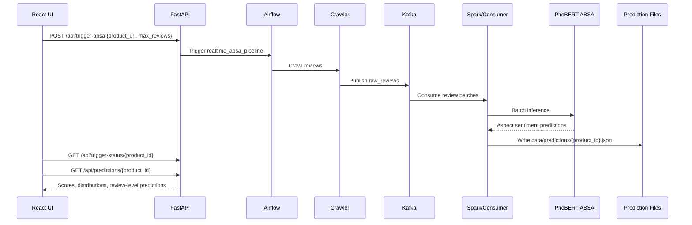

# Real-Time ABSA System for Lazada Reviews

Hệ thống phân tích cảm xúc theo khía cạnh (Aspect-Based Sentiment Analysis - ABSA)
cho đánh giá sản phẩm Lazada. Dự án kết hợp React frontend, FastAPI backend,
Airflow orchestration, Kafka/Spark streaming pipeline, crawler Lazada và mô hình
PhoBERT multi-polarity cho tiếng Việt.

## Mục Tiêu

- Tìm kiếm sản phẩm Lazada và kích hoạt pipeline crawl review theo sản phẩm.
- Phân tích sentiment theo từng khía cạnh thương mại điện tử thay vì chỉ dự đoán
  sentiment tổng quát.
- Hỗ trợ nhiều polarity trên cùng một khía cạnh, ví dụ một review có thể vừa khen
  giá nhưng chê vận chuyển.
- Tách dần phần model serving khỏi API gateway để phục vụ latency thấp và traffic cao.
- Cung cấp pipeline training/evaluation qua Airflow để cập nhật model có kiểm soát.

## Khía Cạnh Phân Tích

Mô hình hiện dự đoán 9 khía cạnh:

- Chất lượng sản phẩm
- Hiệu năng & Trải nghiệm
- Đúng mô tả
- Giá cả & Khuyến mãi
- Vận chuyển
- Đóng gói
- Dịch vụ & Thái độ Shop
- Bảo hành & Đổi trả
- Tính xác thực

Mỗi khía cạnh có hai tầng dự đoán:

- `mentioned`: review có nhắc đến khía cạnh đó hay không.
- `sentiments`: danh sách nhãn sentiment thuộc `NEG`, `POS`, `NEU`.

## Kiến Trúc Hệ Thống



## Luồng Realtime ABSA



## Kiến Trúc Mô Hình

```mermaid
flowchart TD
    A[Raw Vietnamese review text] --> B[PhoBERT Tokenizer]
    B --> C[PhoBERT Backbone<br/>vinai/phobert-base]
    C --> D[[CLS] representation]
    D --> E[Dropout]
    E --> F[Mention Head<br/>9 sigmoid outputs]
    E --> G[Sentiment Head<br/>9 x 3 sigmoid outputs]

    F --> H[Aspect mentioned flags]
    G --> I[NEG / POS / NEU per aspect]
    H --> J[Multi-polarity ABSA result]
    I --> J
```

Mô hình chính nằm trong `model/phobert_trainer_multipolarity.py` và runtime predictor
nằm trong `app/absa_predictor.py`. Runtime ưu tiên model:

```text
models/phobert_absa_multipolarity/phobert_absa_multipolarity.pt
```

Nếu model multi-polarity không tồn tại, predictor có fallback sang model cũ:

```text
models/phobert_absa/phobert_absa.pt
```

## Input Và Output

### Product Search

Input:

```json
{
  "keyword": "áo thun nam",
  "limit": 20
}
```

Output:

```json
[
  {
    "title": "Product name",
    "price": "120000",
    "link": "https://www.lazada.vn/...",
    "reviews": 125,
    "image": "https://...",
    "item_id": "123456",
    "rating": 4.7,
    "sold": "1k sold"
  }
]
```

### Manual Text Prediction

Endpoint:

```text
POST /api/predict-text
```

Input:

```json
{
  "text": "Sản phẩm tốt, đóng gói cẩn thận nhưng giao hàng hơi chậm."
}
```

Output:

```json
{
  "text": "Sản phẩm tốt, đóng gói cẩn thận nhưng giao hàng hơi chậm.",
  "aspects": {
    "Chất lượng sản phẩm": {
      "mentioned": true,
      "sentiments": ["POS"]
    },
    "Vận chuyển": {
      "mentioned": true,
      "sentiments": ["NEG"]
    }
  }
}
```

### Product Pipeline Trigger

Endpoint:

```text
POST /api/trigger-absa
```

Input:

```json
{
  "product_url": "https://www.lazada.vn/products/...",
  "max_reviews": 50
}
```

Output:

```json
{
  "success": true,
  "message": "Pipeline triggered successfully",
  "dag_run_id": "react_trigger_...",
  "product_id": "123456"
}
```

### Prediction Artifact

Runtime output được ghi vào:

```text
data/predictions/{product_id}.json
```

Mỗi record thường gồm:

```json
{
  "product_id": "123456",
  "review_id": "review-id",
  "text": "Nội dung review",
  "sentiment": {
    "Chất lượng sản phẩm": 1,
    "Vận chuyển": -1
  },
  "multipolarity": {
    "Chất lượng sản phẩm": {
      "mentioned": true,
      "sentiments": ["POS"]
    }
  }
}
```

## API Chính

| Method | Endpoint | Mục đích |
| --- | --- | --- |
| `GET` | `/` | Health check cơ bản của API |
| `GET` | `/api/model-info` | Thông tin khía cạnh, sentiment classes và trạng thái model |
| `GET` | `/api/search?keyword=...&limit=20` | Tìm sản phẩm Lazada |
| `POST` | `/api/predict-text` | Dự đoán ABSA cho một review thủ công |
| `POST` | `/api/trigger-absa` | Kích hoạt pipeline crawl và phân tích một sản phẩm |
| `GET` | `/api/trigger-status/{product_id}` | Kiểm tra trạng thái kết quả theo product id |
| `GET` | `/api/predictions` | Liệt kê prediction files |
| `GET` | `/api/predictions/{product_id}` | Lấy kết quả phân tích của một sản phẩm |
| `DELETE` | `/api/predictions/clear` | Xóa prediction runtime output |
| `POST` | `/api/evaluate-model` | Chạy evaluation model trên tập labeled |

Dedicated inference service trong `serving/` cung cấp API gọn hơn cho model serving:

| Method | Endpoint | Mục đích |
| --- | --- | --- |
| `GET` | `/health` | Kiểm tra trạng thái inference service |
| `GET` | `/model-info` | Thông tin model runtime |
| `POST` | `/predict` | Dự đoán một review |
| `POST` | `/predict-batch` | Dự đoán batch review |

## Cấu Trúc Thư Mục

```text
.
├── api/                         # FastAPI gateway cho frontend
├── app/                         # Predictor, crawler, Kafka consumer, Streamlit utilities
├── airflow/dags/                # DAG realtime, simulation và training
├── docker/                      # Dockerfile cho từng service
├── kafka/                       # Producer/consumer demo cũ
├── labeled/                     # Dữ liệu gán nhãn dùng cho PhoBERT training
├── lazada-product-explorer/     # React frontend
├── lazada_crawler/              # Crawler app độc lập
├── model/                       # Training code và model definitions
├── models/                      # Model artifacts runtime
├── scripts/                     # Benchmark và tooling kỹ thuật
├── serving/                     # Dedicated inference service
├── data/                        # Runtime input/output, triggers, predictions
└── docker-compose.yaml          # Local orchestration
```

## Training Và Evaluation

Training code chính:

- `model/phobert_trainer_multipolarity.py`: train/evaluate/predict PhoBERT ABSA multi-polarity.
- `model/train_pipeline.py`: training pipeline cũ cho DAG `sentiment_model_training`.
- `model/phobert_trainer.py`: trainer/model definition cũ, vẫn được Spark inference tham chiếu.

Airflow DAGs liên quan:

- `phobert_absa_training`: train PhoBERT multi-polarity từ `labeled/`.
- `sentiment_model_training`: chạy pipeline training cũ.
- `realtime_absa_pipeline`: crawl review và chạy ABSA realtime theo sản phẩm.

Training input:

```text
labeled/*.xlsx
```

Training output:

```text
models/phobert_absa_multipolarity/
├── phobert_absa_multipolarity.pt
├── config.json
└── tokenizer/
```

## Chạy Hệ Thống

Tạo `.env` nếu chưa có:

```bash
echo "AIRFLOW_UID=$(id -u)" > .env
```

Khởi tạo Airflow:

```bash
docker-compose up airflow-init
```

Chạy toàn bộ backend pipeline:

```bash
docker-compose up -d
```

Các service chính:

| Service | URL |
| --- | --- |
| FastAPI | `http://localhost:8000` |
| Airflow | `http://localhost:8080` |
| Spark UI | `http://localhost:8081` |
| Streamlit | `http://localhost:8501` |

Chạy frontend:

```bash
cd lazada-product-explorer
npm install
npm run dev
```

Build frontend:

```bash
cd lazada-product-explorer
npm run build
```

Chạy inference service riêng:

```bash
uvicorn serving.inference_service:app --host 0.0.0.0 --port 9000
```

## Tối Ưu Latency Và High Traffic

Các tối ưu đã có trong codebase:

- Batch inference trong `PhoBERTPredictor.predict_batch`.
- `torch.inference_mode()` để giảm overhead khi suy luận.
- Batch consumer cho Kafka review stream.
- Spark partition động dựa trên số lượng review.
- Service boundary riêng trong `serving/` để tách model serving khỏi API gateway.

Các biến môi trường quan trọng:

| Biến | Ý nghĩa | Giá trị gợi ý |
| --- | --- | --- |
| `ABSA_BATCH_SIZE` | Batch size khi inference | `16` - `64` |
| `ABSA_MAX_LENGTH` | Max token length cho PhoBERT | `128` - `256` |
| `ABSA_CONSUMER_BATCH_SIZE` | Số review gom trước khi xử lý | `32` - `256` |
| `ABSA_CONSUMER_BATCH_TIMEOUT` | Timeout gom batch consumer | `2` - `10` giây |
| `SPARK_TARGET_ROWS_PER_PARTITION` | Số dòng mục tiêu mỗi Spark partition | `500` - `2000` |

Benchmark inference:

```bash
python3 scripts/benchmark_inference.py --batch-size 32 --iterations 20
```

## Hướng Phát Triển

- Thay file-based `data/predictions` bằng PostgreSQL hoặc OLAP store cho truy vấn nhiều sản phẩm.
- Dùng Redis cache cho kết quả search, trigger status và prediction summary.
- Tách `serving/` thành service độc lập có autoscaling.
- Export model sang ONNX Runtime hoặc TorchScript để giảm latency.
- Distillation hoặc quantization PhoBERT cho inference cost thấp hơn.
- Chuẩn hóa schema event Kafka cho `raw_reviews`, `prediction_completed` và `pipeline_status`.

## Ghi Chú Vận Hành

- `models/` cần được mount hoặc copy đầy đủ khi chạy inference offline.
- `data/predictions/` và `data/triggers/` là runtime output, có thể xóa khi muốn chạy lại pipeline.
- `node_modules/`, `dist/`, `build/` và `__pycache__/` là generated artifacts, không nên commit.
- `lazada-product-explorer/` hiện là frontend app riêng; nếu quản lý bằng Git lồng bên trong, cần xử lý commit/push riêng cho thư mục này.
