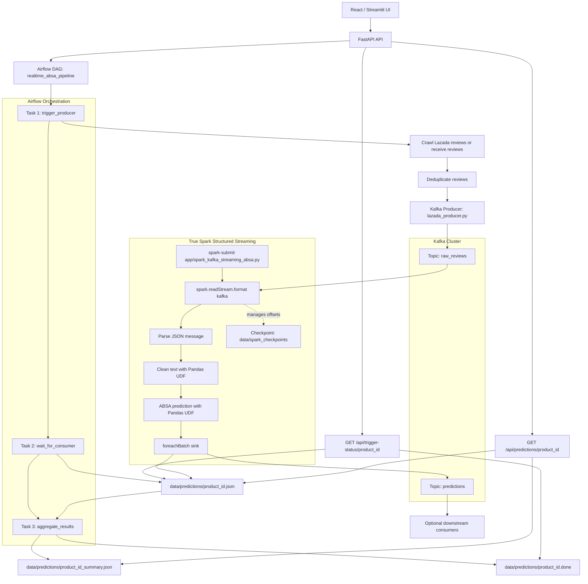
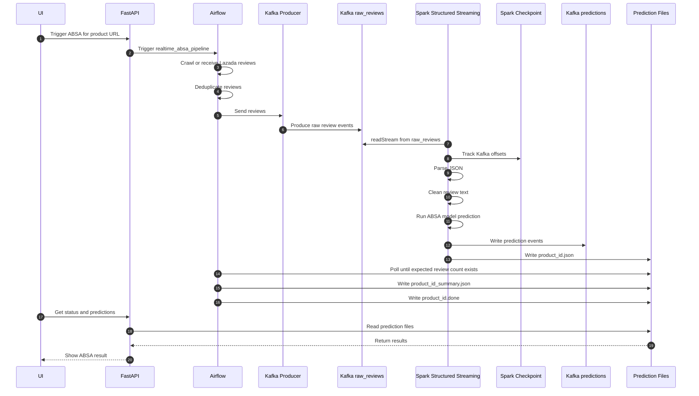

# True Spark Kafka Airflow Flow

This document explains the updated realtime ABSA flow after replacing the old
Python `KafkaConsumer` batching path with a true Spark Structured Streaming
Kafka pipeline.

The short version:

```text
User/API
  -> Airflow
  -> Kafka raw_reviews
  -> Spark Structured Streaming readStream
  -> ABSA inference
  -> Kafka predictions
  -> prediction JSON files
  -> Airflow summary
  -> API/UI result
```

## 1. Why This Is Now True Spark Structured Streaming

Before the update, the project used this pattern:

```text
Kafka
  -> Python KafkaConsumer
  -> Python list buffer
  -> spark.createDataFrame(list)
  -> Spark batch job
```

That was useful, but Spark did not own Kafka ingestion. Python consumed Kafka,
then Spark only processed a finite batch.

The new flow uses this pattern:

```text
Kafka
  -> spark.readStream.format("kafka")
  -> streaming DataFrame
  -> Spark micro-batches
  -> foreachBatch sink
```

This is true Spark Structured Streaming because:

- Spark reads Kafka directly.
- Spark owns the long-running streaming query.
- Spark tracks Kafka offsets through checkpoint state.
- Spark continuously processes new events as micro-batches.
- Spark writes output continuously through `foreachBatch`.

Main streaming file:

```text
app/spark_kafka_streaming_absa.py
```

Docker service that runs it:

```text
kafka-consumer
```

Even though the service is still named `kafka-consumer` in Docker Compose, it now
runs `spark-submit`, not a Python `KafkaConsumer`.

## 2. Full Flow Diagram

Paste this into Mermaid without the surrounding Markdown fences if your editor
expects raw Mermaid:



## 3. Block By Block Explanation

## Block 1: UI

The UI is the user's entry point. It can be the React frontend, Streamlit app, or
any client calling the FastAPI backend.

The user selects or enters a Lazada product URL and starts the ABSA pipeline.

Typical request:

```text
POST /api/trigger-absa
```

Example input:

```json
{
  "product_url": "https://www.lazada.vn/products/...",
  "max_reviews": 50
}
```

The UI does not talk to Kafka or Spark directly. It talks only to the API.

## Block 2: FastAPI API

FastAPI receives the request from the UI and triggers Airflow.

Main file:

```text
api/main.py
```

Main endpoint:

```text
POST /api/trigger-absa
```

The API extracts or creates a `product_id`, then asks Airflow to run the
`realtime_absa_pipeline` DAG.

The API also provides read endpoints after the pipeline starts:

```text
GET /api/trigger-status/{product_id}
GET /api/predictions/{product_id}
```

These endpoints read files from:

```text
data/predictions/
```

So the API is both:

- the trigger layer before processing starts;
- the result layer after Spark and Airflow finish processing.

## Block 3: Airflow DAG

Airflow coordinates the lifecycle of one product analysis run.

Main DAG:

```text
airflow/dags/realtime_absa_dag.py
```

DAG name:

```text
realtime_absa_pipeline
```

The DAG has three main tasks:

```text
trigger_producer -> wait_for_consumer -> aggregate_results
```

Airflow does not directly run Spark code in this flow. Spark runs as a separate
long-running streaming service. Airflow sends input to Kafka, waits for Spark's
output file, then aggregates the final result.

That separation is important:

```text
Airflow = orchestration
Kafka = event transport
Spark = streaming computation
API/UI = user access
```

## Block 4: Airflow Task `trigger_producer`

This is the first Airflow task.

It does four things:

1. Receives product information from the API or manual DAG params.
2. Crawls Lazada reviews, or uses pre-crawled reviews if they were provided.
3. Deduplicates reviews.
4. Sends review events to Kafka.

The deduplication step removes repeated reviews before they enter Kafka. This
keeps Spark from wasting compute on duplicate text.

The producer function is:

```text
app/lazada_producer.py
```

Kafka topic:

```text
raw_reviews
```

Each review becomes one Kafka event.

## Block 5: Kafka Producer

The Kafka producer converts a Python review dictionary into a JSON Kafka message.

Each message contains fields like:

```json
{
  "product_id": "123456",
  "review_content": "San pham tot, giao hang nhanh",
  "rating": 5,
  "review_id": "123456_abc",
  "timestamp": 1234567890.123
}
```

Important fields:

- `product_id`: groups predictions by product.
- `review_content`: the raw review text.
- `rating`: original user rating from Lazada if available.
- `review_id`: unique review identifier.
- `timestamp`: event creation time.

Spark later parses this JSON from Kafka.

## Block 6: Kafka Topic `raw_reviews`

`raw_reviews` is the input event stream.

This topic stores raw review events. It decouples Airflow/crawling from Spark
processing.

That means:

- Airflow does not need to wait for Spark before publishing input.
- Spark can be restarted without changing the producer code.
- Kafka can buffer events if Spark is temporarily slow.
- Multiple consumers could read the same review stream in the future.

Kafka is not doing sentiment analysis. Kafka is only the durable event pipe.

## Block 7: Spark Structured Streaming Job

This is the new core of the pipeline.

Main file:

```text
app/spark_kafka_streaming_absa.py
```

Docker Compose starts it with:

```text
spark-submit --packages org.apache.spark:spark-sql-kafka-0-10_2.12:3.5.0 /app/app/spark_kafka_streaming_absa.py
```

The Kafka connector package is required because Spark needs Kafka source/sink
support.

The Spark job is long-running. It starts once and stays alive, continuously
listening for new Kafka messages.

Important environment variables:

```text
KAFKA_BOOTSTRAP_SERVERS=kafka:29092
KAFKA_INPUT_TOPIC=raw_reviews
KAFKA_OUTPUT_TOPIC=predictions
KAFKA_STARTING_OFFSETS=latest
SPARK_CHECKPOINT_DIR=/app/data/spark_checkpoints/absa_kafka_stream
SPARK_TRIGGER_INTERVAL=5 seconds
SPARK_MASTER=spark://spark-master:7077
```

## Block 8: `spark.readStream.format("kafka")`

This is the key part that makes the flow true Spark Structured Streaming.

The job builds a streaming DataFrame from Kafka:

```python
spark.readStream.format("kafka")
```

Spark reads from:

```text
raw_reviews
```

Kafka records arrive with a binary `key`, binary `value`, topic, partition,
offset, and timestamp. The project mainly uses `value`, which contains the JSON
review message.

Conceptually:

```text
Kafka records
  -> Spark streaming DataFrame
  -> one row per Kafka event
```

This DataFrame is unbounded, meaning it represents data that can keep arriving
forever.

## Block 9: Spark Checkpoint

Checkpoint path:

```text
data/spark_checkpoints/absa_kafka_stream
```

The checkpoint stores streaming progress. Most importantly, it stores which
Kafka offsets Spark has already processed.

Example:

```text
topic raw_reviews
partition 0
processed offset 120
```

If Spark restarts, it can continue from the checkpoint instead of starting over
from the beginning.

This is one of the biggest differences between true Structured Streaming and the
old Python consumer path.

Important rule:

- Keep the checkpoint if you want Spark to resume normally.
- Delete the checkpoint if you intentionally want to replay from
  `KAFKA_STARTING_OFFSETS`.

For testing from old Kafka messages:

```text
KAFKA_STARTING_OFFSETS=earliest
delete data/spark_checkpoints/absa_kafka_stream
restart kafka-consumer service
```

## Block 10: Parse JSON Message

Kafka stores the review event as a JSON string inside the Kafka `value`.

Spark converts it from bytes to string, then parses it with a schema.

The expected fields are:

```text
product_id
review_content
review_text
reviewContent
content
rating
review_id
timestamp
```

Multiple review text field names are supported because different parts of the
project have used different naming conventions.

Spark chooses the first available text field:

```text
review_content
or review_text
or reviewContent
or content
or empty string
```

The result after parsing looks like:

```text
product_id | review_id | original_text | rating
```

## Block 11: Generate Missing `review_id`

If an event does not contain `review_id`, Spark creates one using a SHA-256 hash
from:

```text
product_id + original_text + original JSON
```

This matters because output files use `review_id` to avoid duplicates.

Without a stable ID, retries or restarts could append repeated predictions.

## Block 12: Repartition Stream

Spark repartitions the parsed stream before UDF work:

```text
repartition(target_partitions, product_id)
```

Why:

- spreads work across Spark tasks;
- keeps rows distributed by product;
- improves parallelism for cleaning and inference;
- avoids processing everything in one partition.

Default target partitions:

```text
SPARK_STREAM_REPARTITION=4
```

For larger workloads, this can be increased. It should usually be related to the
number of Spark worker cores and model capacity.

## Block 13: Clean Text With Pandas UDF

Spark applies a Pandas UDF to clean the review text.

Cleaning logic:

- convert to lowercase;
- remove HTML tags;
- normalize whitespace;
- replace null text with an empty string.

Input:

```text
original_text
```

Output:

```text
cleaned_text
```

Why Pandas UDF:

- Spark sends a batch of rows to Python using Arrow.
- Python processes a Pandas Series instead of one row at a time.
- This is faster than a normal Python UDF.
- The same code can run in parallel on Spark workers.

## Block 14: ABSA Prediction With Pandas UDF

After cleaning, Spark applies another Pandas UDF for model inference.

Input:

```text
cleaned_text
```

Output:

```text
sentiment_json
```

The UDF can use:

- PhoBERT predictor;
- Ollama predictor.

The active model backend is read from:

```text
model_config.json
```

If the active model is `phobert`, the UDF calls:

```text
PhoBERTPredictor.predict_batch(..., format="multipolarity")
```

The output is JSON like:

```json
{
  "Chất lượng sản phẩm": {
    "mentioned": true,
    "sentiments": ["POS"]
  },
  "Vận chuyển": {
    "mentioned": true,
    "sentiments": ["NEG"]
  },
  "Đóng gói": {
    "mentioned": false,
    "sentiments": null
  }
}
```

This is multi-polarity ABSA. One aspect can contain multiple sentiment labels,
for example:

```json
{
  "Chất lượng sản phẩm": {
    "mentioned": true,
    "sentiments": ["POS", "NEG"]
  }
}
```

That means the same review both praises and criticizes the same aspect.

## Block 15: Predictor Singleton Per Spark Worker

Model loading is expensive, so the streaming job keeps a predictor singleton
inside each Spark Python worker process.

The first time a worker receives a batch:

```text
load model
load tokenizer
keep predictor in worker memory
```

Later batches reuse the same predictor.

This avoids loading PhoBERT for every row or every micro-batch.

The model config is checked periodically, so changing `model_config.json` can
switch the backend without rewriting the streaming code.

## Block 16: Spark Micro-Batches

Structured Streaming processes the infinite Kafka stream as small finite chunks
called micro-batches.

In this project:

```text
SPARK_TRIGGER_INTERVAL=5 seconds
```

That means Spark checks for new Kafka records about every 5 seconds.

Each micro-batch goes through:

```text
parse JSON
clean text
predict ABSA
foreachBatch sink
checkpoint progress
```

Micro-batch processing gives a practical balance:

- much easier than row-by-row processing;
- faster because model prediction can be batched;
- still close to realtime for the UI.

## Block 17: `foreachBatch` Sink

The output side uses:

```text
foreachBatch(process_microbatch)
```

This gives custom control over each micro-batch.

Inside each micro-batch, the code does two writes:

1. Write prediction events to Kafka topic `predictions`.
2. Write prediction files to `data/predictions/{product_id}.json`.

This hybrid output is intentional.

Kafka output makes the flow event-driven and extensible. JSON files keep
compatibility with the current Airflow and API code.

## Block 18: Kafka Topic `predictions`

The `predictions` topic receives processed ABSA prediction events.

This makes the output stream reusable.

Future services can consume `predictions` directly, for example:

- a notification service;
- a realtime dashboard;
- a database writer;
- a monitoring service;
- an analytics pipeline.

The current API does not yet read directly from this topic. It still reads the
JSON files for compatibility.

## Block 19: Prediction JSON Files

Spark also writes:

```text
data/predictions/{product_id}.json
```

Each row looks like:

```json
{
  "review_id": "abc123",
  "original_text": "San pham tot, giao hang nhanh",
  "cleaned_text": "san pham tot, giao hang nhanh",
  "sentiment": {
    "Chất lượng sản phẩm": {
      "mentioned": true,
      "sentiments": ["POS"]
    }
  },
  "rating": "5",
  "processed_at": 1234567890.123
}
```

Why files still exist:

- Airflow currently waits for these files.
- FastAPI currently reads these files.
- The frontend already expects API responses based on these files.

The write is atomic:

```text
write temporary file
fsync
replace original file
```

That reduces the chance of API/Airflow reading a half-written JSON file.

## Block 20: Airflow Task `wait_for_consumer`

The task name still says `consumer`, but after the update it is really waiting
for Spark Structured Streaming output.

It polls:

```text
data/predictions/{product_id}.json
```

It waits until:

```text
number of predictions >= expected review count
```

Then it allows the DAG to continue to aggregation.

Airflow is not consuming Kafka here. It only checks whether Spark has written
the expected product result file.

## Block 21: Airflow Task `aggregate_results`

After enough predictions exist, Airflow aggregates sentiment counts by aspect.

Input:

```text
data/predictions/{product_id}.json
```

Output:

```text
data/predictions/{product_id}_summary.json
data/predictions/{product_id}.done
```

The summary contains counts like:

```json
{
  "Vận chuyển": {
    "positive": 10,
    "negative": 4,
    "neutral": 2
  }
}
```

The `.done` file marks that the pipeline is fully complete for that product.

## Block 22: API Status Endpoint

The API status endpoint checks:

```text
data/predictions/{product_id}.json
data/predictions/{product_id}.done
```

If prediction JSON exists but `.done` does not exist:

```text
status = processing
```

If both prediction JSON and `.done` exist:

```text
status = completed
```

This is how the UI knows whether to keep waiting or show final results.

## Block 23: API Prediction Endpoint

The API prediction endpoint reads:

```text
data/predictions/{product_id}.json
```

Then it calculates aspect scores and distributions for the frontend.

Endpoint:

```text
GET /api/predictions/{product_id}
```

The frontend receives:

- review-level predictions;
- aspect-level scores;
- sentiment distribution;
- total review count.

## 4. Sequence Diagram



## 5. Runtime Services

The main services involved are:

```text
zookeeper
kafka
airflow-webserver
airflow-scheduler
spark-master
spark-worker
kafka-consumer
absa-api
streamlit-app
```

The important naming detail:

```text
kafka-consumer
```

is now the Spark streaming service. It runs:

```text
spark-submit app/spark_kafka_streaming_absa.py
```

It is not the old Python `KafkaConsumer` loop anymore.

## 6. Important Configuration

Kafka:

```text
KAFKA_BOOTSTRAP_SERVERS=kafka:29092
KAFKA_INPUT_TOPIC=raw_reviews
KAFKA_OUTPUT_TOPIC=predictions
```

Spark:

```text
SPARK_MASTER=spark://spark-master:7077
SPARK_TRIGGER_INTERVAL=5 seconds
SPARK_STREAM_REPARTITION=4
SPARK_EXECUTOR_MEMORY=2g
SPARK_DRIVER_MEMORY=1g
```

Checkpoint:

```text
SPARK_CHECKPOINT_DIR=/app/data/spark_checkpoints/absa_kafka_stream
```

Kafka offset behavior:

```text
KAFKA_STARTING_OFFSETS=latest
```

With `latest`, Spark processes only new messages after the stream starts.

For replay testing:

```text
KAFKA_STARTING_OFFSETS=earliest
delete checkpoint directory
restart the streaming service
```

## 7. How To Run

Build and start the main streaming services:

```bash
docker compose up -d --build kafka zookeeper spark-master spark-worker kafka-consumer
```

View Spark streaming logs:

```bash
docker compose logs -f kafka-consumer
```

Start the API and Airflow services if they are not already running:

```bash
docker compose up -d airflow-webserver airflow-scheduler absa-api
```

Airflow UI:

```text
http://localhost:8080
```

Spark UI:

```text
http://localhost:8081
```

FastAPI:

```text
http://localhost:8000
```

## 8. How To Think About Failures

If Kafka is down:

```text
Airflow producer cannot publish raw reviews.
Spark readStream cannot read input.
```

If Spark is down:

```text
Kafka can still store raw_reviews.
Airflow will wait and eventually timeout because prediction files are not created.
```

If Airflow is down:

```text
Spark can still process Kafka messages if any are produced by another source.
The normal product pipeline trigger may not start from the API.
```

If the model is missing:

```text
Spark workers cannot produce useful PhoBERT predictions.
Prediction rows may contain empty or fallback results.
```

If checkpoint is deleted:

```text
Spark forgets processed offsets.
On restart, Spark uses KAFKA_STARTING_OFFSETS again.
```

If prediction JSON file is deleted:

```text
API will not show previous results.
Airflow status for that product may go back to not_found or processing.
```

## 9. Current Design Tradeoffs

This update gives the project true Spark Kafka streaming, but it intentionally
keeps JSON files for compatibility.

Current design:

```text
Spark readStream from Kafka
Spark writes predictions to Kafka
Spark also writes prediction JSON files
Airflow/API still use JSON files
```

More production-grade future design:

```text
Spark readStream from Kafka
Spark writes predictions to Kafka or database
API reads from database/cache
Airflow monitors pipeline state from database/events
```

The current design is a good transition step because it upgrades Kafka/Spark
correctly without forcing a full API and Airflow rewrite.

## 10. Summary

The new flow is:

```text
Airflow publishes review events to Kafka.
Spark Structured Streaming reads Kafka directly.
Spark parses, cleans, predicts, checkpoints, and writes output.
Kafka predictions topic receives realtime prediction events.
Prediction JSON files preserve compatibility with Airflow and API.
Airflow aggregates and marks the product run complete.
API serves results to the UI.
```

The most important technical change is this:

```text
Old: Python KafkaConsumer owned Kafka ingestion.
New: Spark readStream owns Kafka ingestion.
```

That is what makes the updated pipeline a true Spark Structured Streaming Kafka
flow.
